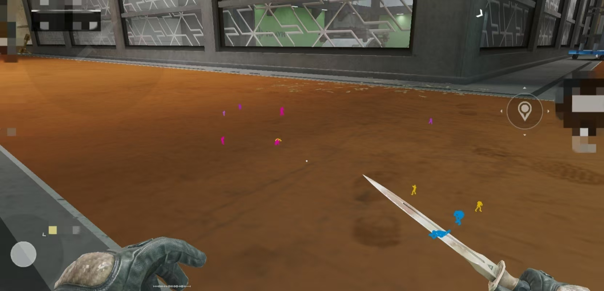

# AndUEChams

## Screenshots



---

## Build

**环境要求：**
- CMake 3.22.1+
- Android NDK（ARM64-v8a，API 27+）

```bash
# 设置 NDK_HOME 环境变量（替换为你的 NDK 实际路径）
export NDK_HOME=/path/to/android-ndk
git submodule update --init --recursive
cmake -B build -G "Ninja" -DCMAKE_BUILD_TYPE=Release
cmake --build build
```

> **⚠️ 请使用 Release 构建，否则注入后可能崩溃**

输出：`libAndUEChams.so`

## Usage

使用 [AndKittyInjector v5.1.0](https://github.com/MJx0/AndKittyInjector) 注入到目标应用：

```bash
./AndKittyInjector --package <包名> -lib libAndUEChams.so --memfd --hide --watch --delay 50
```

---

## Credits

- [AndUEDumper](https://github.com/MJx0/AndUEDumper)
- [AndKittyInjector](https://github.com/MJx0/AndKittyInjector)
- [Dobby](https://github.com/jmpews/Dobby)
- [AndSwapChainHook](https://github.com/DumpA1n/AndSwapChainHook)
